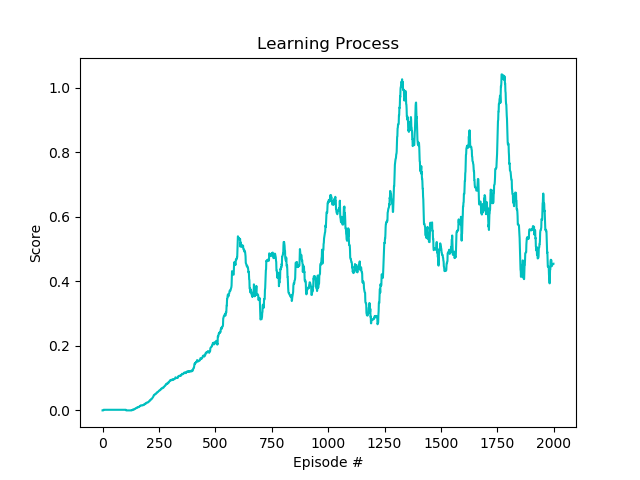

# Deep Reinforcement Learning Project #3 - Report
Here below are reported the main characteristics of the Reinforcement Learning algprithm.

## Learning Algorithm
Considering the nature of the action/state space the selected RL Algorithm was a Deep Deterministic Policy Gradient (DDPG).
Four neural networks are used; Actor and Critic Networks are backed by their corresponding target network and soft-updated by `tau`.
Values of `tau`small enought, ensure stability during the training process.
The Ornstein-Uhlenbeck process is used to introduce noise and ensure exploration during training.
More details of the DDPG can be found [here](https://arxiv.org/abs/1509.02971).

## Model and Parameters
The models of the Critic and Actor are DNN of fully connected layers.
The Actor holds two hidden layers of 256 nodes each.
The Critic holds an hidden layer of 256 + action space and a second hidden layer of 128 nodes. 
The two agent are sharing the two networks during training.

Here the summary of parameters used:

`lrate_critic=1e-3,
lrate_actor=1e-4,
tau=0.01,
gamma=0.99,`

Replay Buffer
`size = 10000,
batch_size = 256`

Ornstein-Uhlenbeck noise
`exploration_mu=0.0,
exploration_theta=0.25,
exploration_sigma=0.30,
noise_decay=0.99995`

## Results

The trend below shows the score avarege on 100 episode achieved by the agent across the learning process.

The 0.5 score is reached around episode 600 with a stable improvement of the agent. After the 600 episodes the results are not so stable but the score achieves peaks of 1.

Running the trained model, the two agent easly keep the ball in game for the entire duracion of the episode, marking scores of 2.6. 

## ToDo list
Much more stuff can be done to around this project.

### Code generalization
Further effort will be spent to generalize the code to make easy moving from an algorithm to another or between environments. That will help on further analysis.

### Deep Analysis of the Paramenters and Architecture
Extensive exploration of the results by changing various hyperparameters but also by appling a different algorithm such as other Actor-Critic methods and PPO benchamarching following the [baselines of OpenAI](https://github.com/openai/baselines).

### Solve the Soccer Environment
Use the *Soccer.ipynb* and adapt the same agent code to solve the soccer environment. That will be a nice test to check the agent training algorithm and the validity of the hyperparamenter in different conditions.
